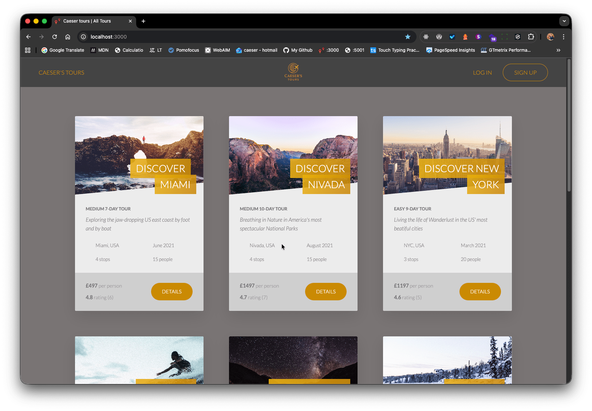

  
  

  
  
  

**Caeser’s Tours 🌍** is a full-stack web application designed to showcase travel tours across Europe and the USA. Built with a focus on performance, security, and accessibility, the site delivers fast, SEO-friendly content using server-side rendering (SSR) and a scalable Node.js + MongoDB backend.

---

#### Powered by server-side rendering and robust backend architecture

## 🚀 Features

- **Server-Side Rendering (SSR)** with Pug templates for improved SEO and page load speed
- Secure user authentication with JWT and bcryptjs
- Real-time tour management via MongoDB (Mongoose ODM)
- Image optimization with `sharp` for fast-loading gallery content
- Rate limiting, input sanitization, and HTTP security headers for enterprise-grade protection
- Email notifications via Nodemailer (booking confirmations, updates)
- File uploads for tour media using Multer
- Comprehensive logging with Morgan
- CORS, compression, and middleware security hardening (Helmet, CORS, hpp, express-mongo-sanitize)

---

## 🔐 Security & Compliance

- All user inputs are sanitized to prevent NoSQL injection
- Rate limiting protects against brute-force attacks
- HTTP headers are hardened with Helmet
- Passwords are hashed using bcryptjs
- JSON Web Tokens (JWT) secure authenticated sessions

---

## 🛠️ Tech Stack

| Layer               | Technology                                                                                                     |
| ------------------- | -------------------------------------------------------------------------------------------------------------- |
| **Backend**         | Node.js, Express.js                                                                                            |
| **Template Engine** | Pug                                                                                                            |
| **Database**        | MongoDB (Mongoose)                                                                                             |
| **Security**        | Helmet, cors, express-rate-limit, express-mongo-sanitize, hpp, bcryptjs, jsonwebtoken                          |
| **Utilities**       | Axios, Body Parser, Cookie Parser, Dotenv, Morgan, Multer, Nodemailer, Sharp, Slugify, Validator, HTML-to-Text |
| **Dev Tools**       | Nodemon, Babel Polyfill                                                                                        |
| **Hosting**         | Deployable on any Node-compatible platform (e.g., Render, Railway, AWS)                                        |

---

📄 Author
Caeser Ibrahim
Full Stack Developer UK, London

---

📜 License
This project is licensed under the ISC License – see the LICENSE file for details.

© Caeser’s Tours — All rights reserved.
